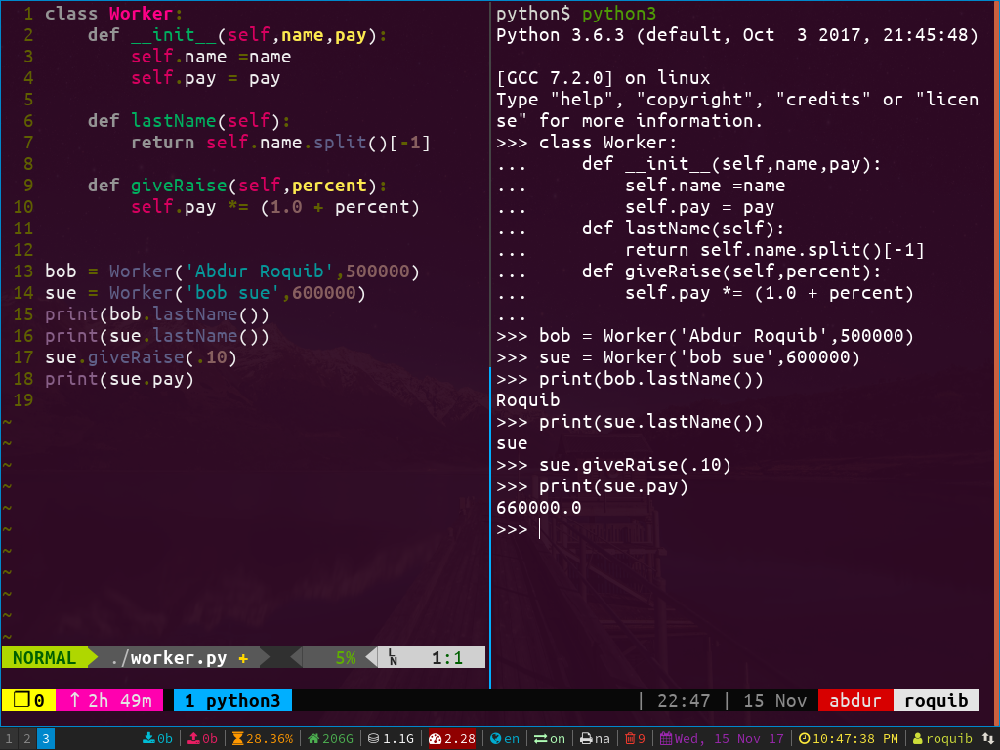

#My i3 ubuntu config



this is my i3 ubuntu
## Installation

```bash
git clone https://github.com/roquib/myi3ubuntusetup.git
cd myi3ubuntusetup
./install.sh
```
## vim setup
open .vimrc file and run
```vim
:PluginInstall
```
## shortcut for running a program inside vim
leader key that i used here is comma => ,
run program for
```
python2
	press F7
python3
	leader e
ruby
	press F8
go
	leader r
java
	leader b
and c,c++,sh
	leader z
```
for more details read .vimrc file
